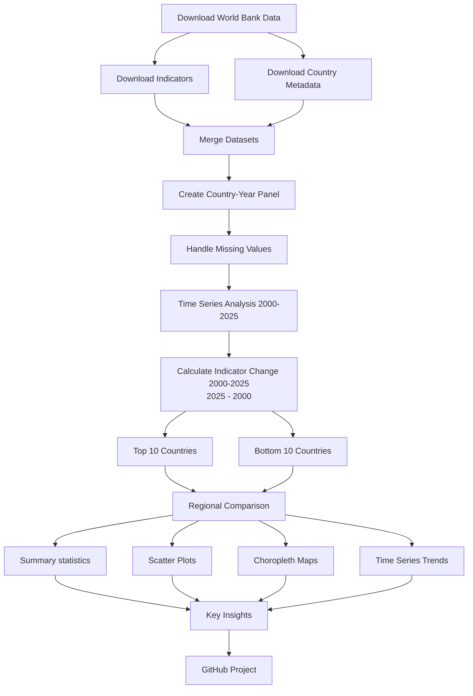

## Workflow

```mermaid
flowchart TD

    A[Download World Bank Data]

    A --> B[Download Indicators]
    A --> C[Download Country Metadata]

    B --> D[Merge Datasets]
    C --> D

    D --> E[Create Country-Year Panel]

    E --> F[Handle Missing Values]

    F --> G[Time Series Analysis 2000-2025]

    G --> H[Calculate Indicator Change 2000-2025<br/>2025 - 2000]

    H --> I[Top 10 Countries]
    H --> J[Bottom 10 Countries]

    I --> K[Regional Comparison]
    J --> K

    K --> L[Time Series Trends]
    K --> M[Scatter Plots]
    K --> N[Choropleth Maps]
    K --> O[Summary statistics]

    O --> P[Key Insights]
    M --> P
    N --> P
    L --> P
    P --> Q[GitHub Project]
```
